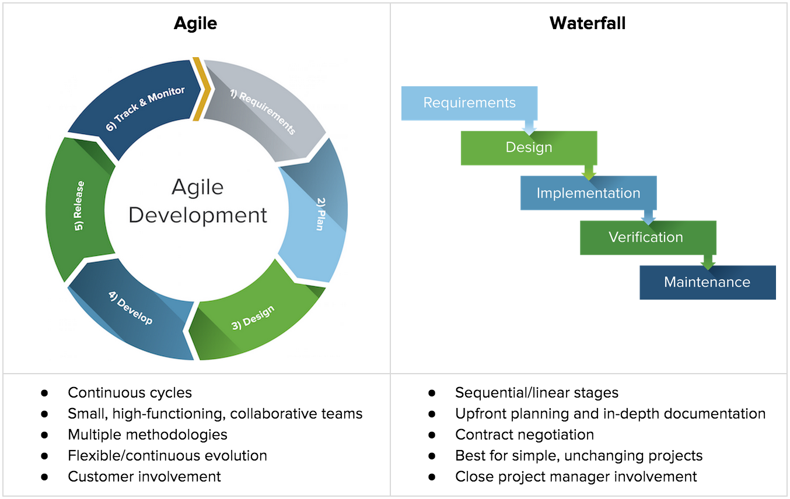
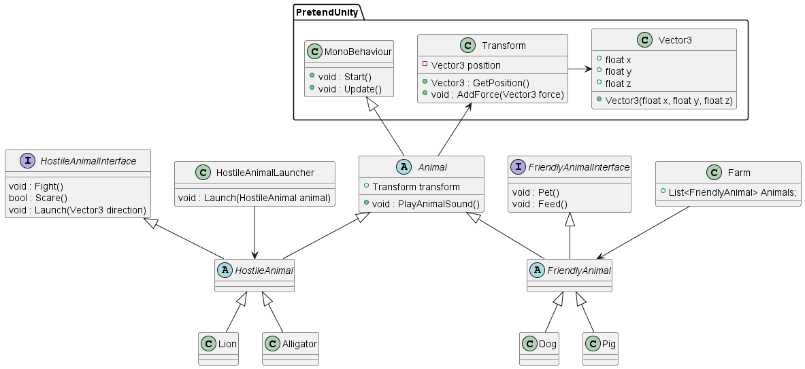

# Table of Content
- [Table of Content](#table-of-content)
- [Methods](#methods)
  - [Software Development Lifecycle (SDLC)](#software-development-lifecycle-sdlc)
    - [Waterfall](#waterfall)
    - [Agile](#agile)
  - [User stories](#user-stories)
  - [Actors](#actors)
  - [Usecases](#usecases)
  - [MuSCoW](#muscow)
- [Software Requirement Specification](#software-requirement-specification)
  - [Actors](#actors-1)
  - [Usecase diagram](#usecase-diagram)
  - [MuSCoW prioritized requirements](#muscow-prioritized-requirements)
- [Software Design](#software-design)
- [Your assignment](#your-assignment)

# Methods

## Software Development Lifecycle (SDLC)

There exists many approaches to "lifecycles" in software, two of the most famous is the Agile and Waterfall.

[List of other SDLC's](https://www.tutorialspoint.com/sdlc/)

### Waterfall

The Waterfall Model was the first Process Model to be introduced. It is also referred to as a linear-sequential life cycle model. It is very simple to understand and use. In a waterfall model, each phase must be completed before the next phase can begin and there is no overlapping in the phases.

### Agile 

Agile SDLC model is a combination of iterative and incremental process models with focus on process adaptability and customer satisfaction by rapid delivery of working software product. Agile Methods break the product into small incremental builds. These builds are provided in iterations. Each iteration typically lasts from about one to three weeks. Every iteration involves cross functional teams working simultaneously on various areas.

[Agile manifesto](https://agilemanifesto.org/)

* Individuals and interactions over processes and tools
* Working software over comprehensive documentation
* Customer collaboration over contract negotiation
* Responding to change over following a plan

## User stories

By telling short stories from the actors point of view, we can better understand expected behaviour of the program and find potential actors.

“As an \<actor>, I \<Want to>, \<so that>.”

* As a player I want to have a farm so that I can pet and feed my animals
* As a farmer I want to have a way to deal with unwelcome animals so that my animals dont get eaten.
* As an animal I want to be fed so that I dont die of hunger.

## Actors

If we go through the user stories, we can identify some actors which helps better define our project and start the design process.

## Usecases

Another way of increasing the quality of your requirement specification is to include a use case diagram.

Usecase diagrams have "actors" and "usecases" and displays how they usecases are connected.

## MuSCoW 
 
 * Must, means that this requirement must be fulfilled! Without the "must" features, the program doesn't make sense for the user of the program.
 * Should, means that this requirement will be next in line, when all the 'musts' are done. The program isnt really ussuable without the "shoulds".
 * Could, means that the requirement/feature is still being thoughtover, and due to uncertainty it is placed as a "could"
 * Want, is the wishfull thinking and for potential later direction with the project

Requirements must abide to the following:
 * Must include atleast 1 actor
 * Must include only 1 MuSCoW priority keyword
 * Must be as short and concise as possible
 * Must not conflict with other requirements
 * Must follow the syntax: 
   * \<The actor> \<MuSCow> \<Requirement description>
 * Must not be duplicate

# Software Requirement Specification

## Actors

 * Player/Farmer
 * Animals
 * Hostile animal
 * Friendly animal

## Usecase diagram

## MuSCoW prioritized requirements

 * The player must be able choose between different hostile animals to launch
 * The player must be able to launch a hostile animal with a variable amount of force in a 3-dimensional direction
 * The animals must not suffer any harm!
 * The player should be able catch the animal after launch
 * The player could be able to relaunch again to move around on a map
 * The player wants to use the launched animal as target practice

# Software Design

# Your assignment

Based on earlier lessons and assignments you should by now have some of the above design already implemented. I have created an example chapter regarding requirements that could lead to the design you have implemented so far.

Your job now is to to implement the rest of the design! After this assignment we will look into Unity, were we can add some graphics and animations to the program and continue working on expanding our feature set!

Changing the requirements, design and implementation to better match your own ideas is strongly encouraged!

OBS. I have included 3 classes (PrentendUnity namespace and folder) which demonstrates our initial approach as Programmers to the unity engine. 