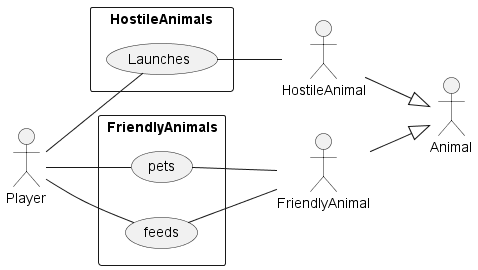

# Table of Content
- [Table of Content](#table-of-content)
- [Software Requirement Specification](#software-requirement-specification)
  - [Methods](#methods)
    - [User storie(s)](#user-stories)
    - [Actors](#actors)
    - [Usecases](#usecases)
    - [MuSCoW](#muscow)
- [MuSCoW prioritized requirements](#muscow-prioritized-requirements)
- [Design](#design)
- [Your assignment](#your-assignment)
# Software Requirement Specification

## Methods

### User storie(s)

By telling short stories we can capture requirements of the expected program behaviour, 

“As an \<actor>, I \<Want to>, \<so that>.”

* As a player I want to have a farm so that I can pet and feed my animals
* As a farmer I want to have a way to deal with unwelcome animals so that my animals dont get eaten.
* As an animal I want to be fed so that I dont die of hunger.

### Actors

If we go through the user stories, we can identify some actors which helps better define our project and start the design process

 * Player/Farmer
 * Animals
 * Hostile animal
 * Friendly animal

### Usecases

Another way of increasing the quality of your requirement specification is to include a use case diagram

### MuSCoW 
 
 * Must, means that this requirement must be fulfilled! Without the "must" features, the program doesn't make sense for the user of the program.
 * Should, means that this requirement will be next in line, when all the 'musts' are done. The program isnt really ussuable without the "shoulds".
 * Could, means that the requirement/feature is still being thoughtover, and due to uncertainty it is placed as a "could"
 * Want, is the wishfull thinking and for potential later direction with the project

Requirements must abide to the following:
 * Must include atleast 1 actor
 * Must include only 1 MuSCoW priority keyword
 * Must be as short and concise as possible
 * Must not conflict with other requirements
 * Must follow the syntax: 
   * \<The actor> \<MuSCow> \<Requirement description>
 * Must not be duplicate

# MuSCoW prioritized requirements

 * The player must be able choose between different hostile animals to launch
 * The player must be able to launch a hostile animal with a variable amount of force in a 3-dimensional direction
 * The animals must not suffer any harm!
 * The player should be able catch the animal after launch
 * The player could be able to relaunch again to move around on a map
 * The player wants to use the launched animal as target practice

# Design, Class diagram

# Your assignment

Based on earlier lessons and assignments you should by now have some of the above design already implemented. I have created an example chapter regarding requirements that could lead to the design you have implemented so far.

Your job now is to to implement the rest of the design! After this assignment we will look into Unity, were we can add some graphics and animations to the program and continue working on expanding our feature set!

Changing the requirements, design and implementation to better match your own ideas is strongly encouraged!

OBS. I have included 3 classes (PrentendUnity namespace and folder) which demonstrates our initial approach as Programmers to the unity engine. 